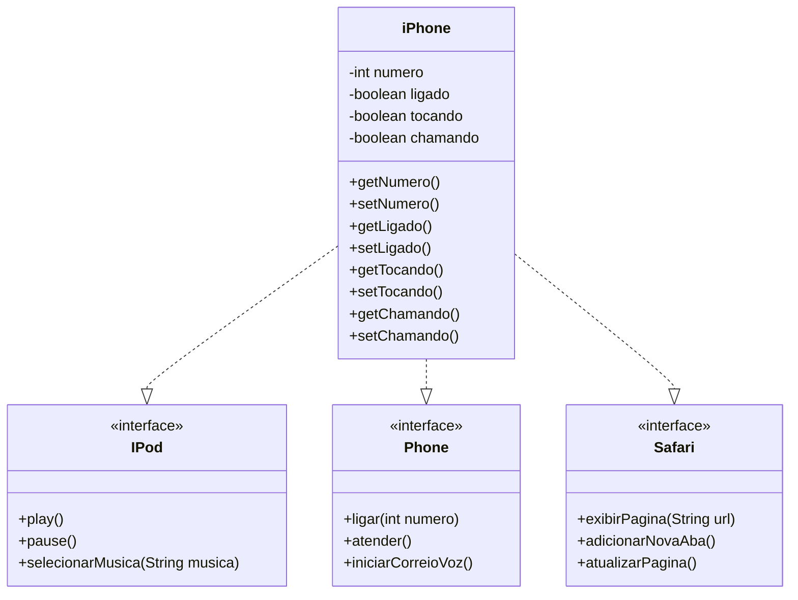

Desafio de implementação da Classe Iphone com 3 interfaces, proposto pelo Bootcamp de Backend com Java oferecido pelo Santander em parceria com a DIO.

Abaixo é possível observar o Diagrama de Classe UML do desafio.

Referência para a elaboração do diagrama UML utilizando a ferramenta [Mermaid](https://mermaid.js.org/syntax/classDiagram.html).
